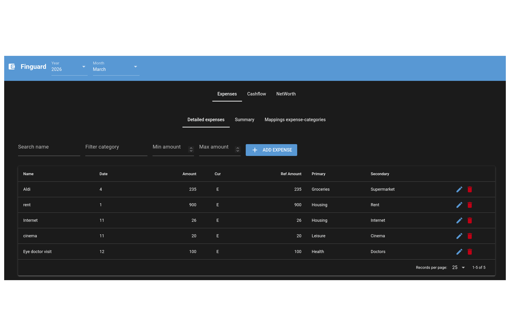

# Finguard

Tool for my personal finance management with an interactive web dashboard.
It monitors investments, expenses, cashflow, liquidity, and net worth. All stored locally as Parquet files with zero cloud dependencies.

It follows a scheme similar to the old [Mr Rip spreadsheets](https://retireinprogress.com/how-i-track-my-finances-using-spreadsheets-part-1-why-and-what/). 

Everything uses [Polars](https://pola.rs/) for data processing and Parquet for storage, simply because I am familiar with both.

I wrote the core logic from scratch, but the user interface was almost entirely vibe-coded with an AI assistant (which also authored most comments and docstrings). As a result, the UI is functional but not polished.

## Features

- **Investment Tracking**: Monitor investments (stocks/ETFs, commodities, bonds) over time.
- **Expense Tracking**: Add, edit, delete, and filter monthly expenses. Auto-categorize via configurable name-to-category mappings.
- **Summary Dashboards**: Monthly and cumulative expense breakdowns by primary/secondary category with interactive charts.
- **Cashflow**: Track salary, interest, dividends, and other income alongside spending. Automatically computes savings and savings rate.
- **Net Worth**: Keep track of all assets: liquidity, credit/debts, investments (stocks/ETFs, commodities, bonds).
- **Local-First**: All data is stored locally in Parquet files.



## Installation

<details>
<summary>Expand</summary>

### Option A: Install and run with docker

Download the `docker-compose.yml` file and cd into the directory where this file is stored.

Before starting the service the user should set `PUID` and `PGID` so files created by the container are owned by the host user. Do one of the following:

- Export in your current shell (temporary for this session):
```
export PUID=$(id -u)
export PGID=$(id -g)
docker compose up -d
```

- Or create a persistent `.env` file next to `docker-compose.yml`. To auto-create it with the current UID/GID:
```
printf 'PUID=%s\nPGID=%s\n' "$(id -u)" "$(id -g)" > .env
```

Finally install with:

```
docker compose up -d
```

Notes:
- `${HOME}` is expanded on the machine where `docker compose` is run. If it is run as `root`, then `${HOME}` may expand to `/root` and bind mounts may point to `/root/.local/share` and `/root/.config`.

### Option B: Install with uv/pip

```bash
# Clone the repository
git clone https://github.com/Ferrangelo/finguard.git
cd finguard

# Create a virtual environment and install (pick one)
uv venv
source .venv/bin/activate   # Linux/macOS
uv pip install .
# pip install .
```

</details>

## Usage

<details>
<summary>Expand</summary>

### Start the web UI (docker)

```bash
# Docker Compose
cd path/to/finguard
docker compose up -d      # start
docker compose down       # stop and remove
```

The UI is available at `http://localhost:8765` as soon as the container starts.


### Start the web UI (uv/pip installation)

If installed with uv/pip, first activate the Python environment on which Finguard was installed and then run

```bash
finguard-ui              # starts on http://localhost:8765
finguard-ui --port 3000  # custom port
```


### Navigate the dashboard

The interface has three main tabs:

| Tab | What it does |
|-----|-------------|
| **Expenses** | View, add, edit, delete, and filter detailed monthly expenses. Switch to the *Summary* sub-tab for category breakdowns and charts. The *Mappings* sub-tab lets you define automatic expense-name-to-category rules. |
| **Cashflow** | Enter monthly income by category (salary, interest, dividends, other). Spending and savings are auto-calculated from expense data. |
| **Net Worth** | Track investment holdings and prices, bank/broker liquidity, and credits/debts. View allocation pie charts and evolution over time. |

Use the **year** and **month** selectors at the top to switch between periods. All data refreshes automatically.
</details>

## Data storage
<details>
<summary>Expand</summary>

Data is stored in two local XDG-compliant directories:

- **Expense & financial data** — `$XDG_DATA_HOME/finguard/` (default: `~/.local/share/finguard/`)
- **Category mappings** — `$XDG_CONFIG_HOME/finguard/` (default: `~/.config/finguard/`)

| What | Path |
|------|------|
| Expense & financial data | `$XDG_DATA_HOME/finguard/dbs/` (default: `~/.local/share/finguard/dbs/`) |
| Category mappings | `$XDG_CONFIG_HOME/finguard/category_mappings.json` (default: `~/.config/finguard/category_mappings.json`) |

Directory layout per year:

```
dbs/
└── 2026/
    ├── 01_detailed_expenses.parquet   # January expenses
    ├── 02_detailed_expenses.parquet   # February expenses
    ├── ...
    ├── primaries.parquet              # Cumulative primary category summary
    ├── secondaries.parquet            # Cumulative secondary category summary
    ├── cashflow.parquet               # Monthly income/spending/savings
    ├── investments.parquet            # Investments holdings
    ├── investments_prices.parquet     # Investment prices
    ├── liquidity.parquet              # Bank accounts & cash
    └── credits_debts.parquet          # Credits/debts
```

</details>

## Limitations

<details>
<summary>Expand</summary>

- **No currency exchange**: all amounts are assumed to be in a single currency.
- **No automatic price updates**: investment prices must be entered manually each month.
- **No authentication or multi-user support**
- **No data import/export**: no CSV, bank-statement, or spreadsheet import; no export functionality (however the parquet files are always saved to disk).
- **No recurring transactions**: every expense must be entered individually; no templates or schedules.
- **Limited mobile experience**

</details>

## Tools used for this project

<details>
<summary>Expand</summary>

- **[NiceGUI](https://nicegui.io/)**: python web framework
- **[Polars](https://pola.rs/)**: fast DataFrame library for data processing
- **[Apache ECharts](https://echarts.apache.org/)**: interactive charts
- **[Matplotlib](https://matplotlib.org/)**
- **[Parquet](https://parquet.apache.org/docs/file-format/)**: efficient columnar storage for all financial data

</details>